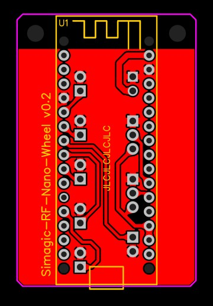

# Overview

(add banner image)

This is a fork of the work started by [Kegetys](https://github.com/Kegetys) with their [simagic-arduino-poc](https://github.com/Kegetys/simagic-arduino-poc). Taking the description of the wireless protocol used by Simagic direct drive wheel bases and rims and making my own wireless rim hardware that can send button presses and aixs data to the Simagic base.
I found some changes to the protocal were needed and those are captured here. Further there is a lot more to the protocol that neither have documented.

# Hardware

My expereimentaion has been conducted using an [RF-Nano](https://github.com/emakefun/rf-nano) (see implementaion details below) which combines an atmega328P with the nesecary nRF24L01 wireless module.


# nRF24L01 setup

In order to communicate with either the rim or the base the nRF24 needs to know the network ID, channel, speed and CRC setup used by Simagic. The work Kegetys undertook, [nRF24L01 setup](https://github.com/Kegetys/simagic-arduino-poc?tab=readme-ov-file#nrf24l01-setup), was foundational in enabling this implementation. Key details sumarised again here:

- The network ID is 0x0110104334.
- The channel can be configured from SimPro Manager and must be matched in the code, defaulted to 80 and it matches the RF24 hardware channel.
- Speed is 250KBps, CRC is 8 bits.
- Dynamic payloads appear to be enabled, but the payload from rim to wheel is always 8 bytes.
- AutoAck is enabled with 7 retires, delay setting 5.
- ACK payloads are enabled and used by the base to send data back to the rim.

### Note about nRF24L01 clones

The RF-Nano I purchased from Aliexpress has the same issues that Kegetys identified. Refer back to [](https://github.com/Kegetys/simagic-arduino-poc?tab=readme-ov-file#note-about-nrf24l01-clones)

# Rim to base packet structure

I found that the default packet structure that my wheel base expects differs to that published by Kegetys. Hardware used for development was a Simagic Alpha wheel base on firmware version 195. It was suggeted that the wheel base may default to the packet structure used by the last wheel connected to it and as I have never has an official Simagic wheel on this base nothing has changed from the factory settings. It may prove intersting to experiment with the init package and different wheel identifiers but that is for the future.

The structure appears to be as follows:
```
Byte 1 = Button 1-8
Byte 2 = Button 9-16
Byte 3 = Axis 2 [0-7]
Byte 4 = Axis 2 [9-12] & Axis 1 [0-3]
Byte 5 = Axis 1 [4-12]
Byte 6 = Button 25-32
Byte 7 = Button 17-24
Byte 8 = CRC being the CRC-8/MAXIM checksum.
```

## Button + axis packet

Each button byte is made up of bit flags for buttons currently held down. Least significant bit is button 1 state, next bit is button 2 state etc.

The two 'clutch' axis are both 12 bit values spread over 3 bytes. Axis 2 is byte 3 and the first 4 bits of byte 4 and Axis 1 is the seccond 4 bits of byte 4 followed by byte 5.

## Rim connect packets

When the rim is connected it identifies itself with the base and the rim apperas in SimPro Manager. However even without this being sent the button packet above works, so you don't actually need to send this for custom rims to work fine.

The data contains at least the rim type, firmware version and what looks like some kind of per-button information (maybe the LED colors?). I haven't fully examined this data, a dump is included in [initpacket.h](simagic-poc/initpacket.h)

# Hardware implementation

See [simagic-rf-nano-wheel/src](simagic-rf-nano-wheel/src) folder for code for a simple wheel rim that has 6 buttons and 2 axis. The [simagic-rf-nano-wheel\hardware](simagic-rf-nano-wheel\hardware) folder will contain information on a basic breakout PCB that has an RF-Nano at its core and connectors for power from the wheel base quick connecter, 6 bottons and 2 axis.

The [simagic class](simagic-rf-nano-wheel/src/simagic.h) has been modified from Kegetys implementation to capture the changes to the wireless prototocal I identified.

My hardware looks like this:



(more to come hardware is still in transit)


